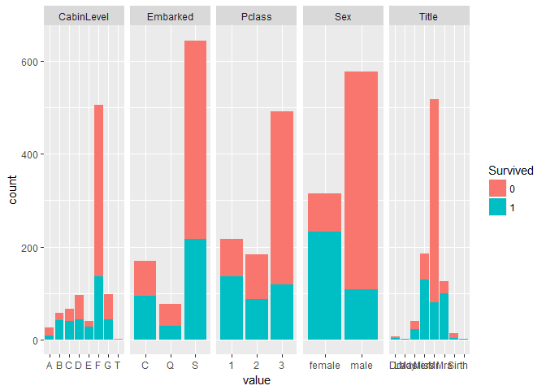
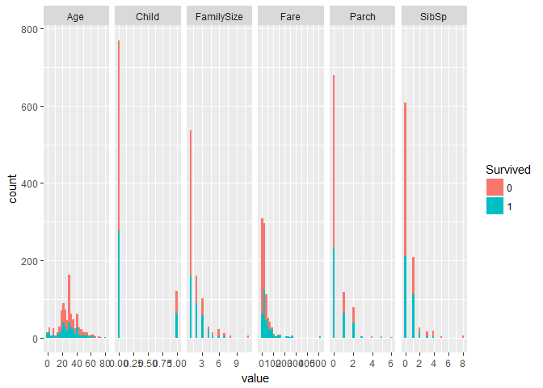
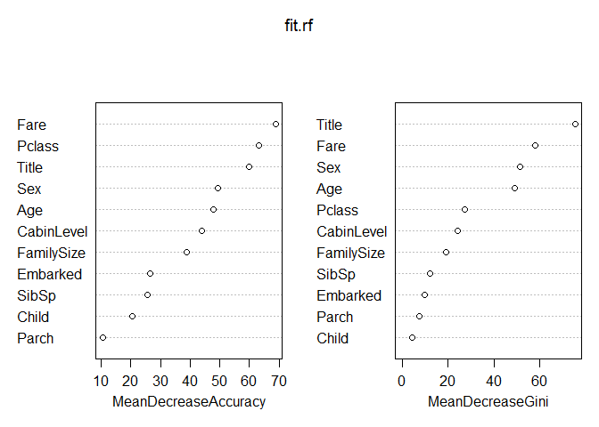

Ex2 - Titanic
================
Yariv Dahan & Maayan Matook
May 7, 2017

set a working directory

``` r
setwd('C:\\Users\\yariv\\Documents\\GitHub\\ex2')
```

Read the train.csv and test.csv files into dataframes

``` r
df.train <- read.csv("train.csv",na.strings = "")
df.test <- read.csv('test.csv',na.strings = "")
```

binding the dfs together in order to do feature engineering

``` r
df.test$Survived <- NA
df.all <- rbind(df.train, df.test)
```

preprocessing and feature engineering
-------------------------------------

changing some columns from string to factor

``` r
df.all$Survived<- as.factor(df.all$Survived)
df.all$Pclass<- as.factor(df.all$Pclass)
```

getting honorific abbreviations (title) out of the name

``` r
library(stringr)
df.all$Name<-str_split_fixed(df.all$Name, ", ", 2)[,2]
df.all$Name<-str_split_fixed(df.all$Name, ". ", 2)[,1]
df.all$Name[df.all$Name %in% c('Don', 'Major', 'Capt', 'Jonkheer', 'Rev', 'Col')] <- 'Sir'
df.all$Name[df.all$Name %in% c('Countess', 'Mme', 'Dona')] <- 'Mrs'
df.all$Name[df.all$Name %in% c('Mlle', 'Ms')] <- 'Miss'
colnames(df.all)[4] <- "Title"
df.all$Title<- as.factor(df.all$Title)
table(df.all$Title)
```

    ## 
    ##     Dr   Lady Master   Miss     Mr    Mrs    Sir     th 
    ##      8      1     61    264    757    199     18      1

extract the cabin level from "Cabin"

``` r
df.all$Cabin<-strtrim(df.all$Cabin, 1)
colnames(df.all)[11] <- "CabinLevel"
df.all$CabinLevel<- as.factor(df.all$CabinLevel)
```

calculating family size

``` r
df.all$FamilySize <- df.all$SibSp + df.all$Parch + 1
```

we want to replce NAs with a value (prediction)

``` r
library('rpart')

#for age
Agefit <- rpart(Age ~ Pclass + Sex + SibSp + Parch + Fare + Embarked + Title + FamilySize,
                  data=df.all[!is.na(df.all$Age),], 
                  method="anova")
df.all$Age[is.na(df.all$Age)] <- predict(Agefit, df.all[is.na(df.all$Age),])

#for embarked
Embarkedfit <- rpart(Embarked ~ Pclass + Sex + Fare + Age + Title + FamilySize,
                  data=df.all[!is.na(df.all$Embarked),], 
                  method="class")
df.all$Embarked[is.na(df.all$Embarked)] <- predict(Embarkedfit, df.all[is.na(df.all$Embarked),], type = "class")

#for CabinLevel
CabinLevelfit <- rpart(CabinLevel ~ Pclass + Sex + Fare + Age + Title + FamilySize + Embarked,
                  data=df.all[!is.na(df.all$CabinLevel),], 
                  method="class")
df.all$CabinLevel[is.na(df.all$CabinLevel)] <- predict(CabinLevelfit, df.all[is.na(df.all$CabinLevel),], type = "class")
```

we will check if the passenger is under 18 (0 = yes). it will be done after replacing NAs with values

``` r
df.all$Child <- 0
df.all$Child[df.all$Age < 18] <- 1
```

we will remove all the rows that have NA in $Fare (only one row)

``` r
df.all$Fare[which(is.na(df.all$Fare))] <- median(df.all$Fare, na.rm=TRUE)
```

erasing some irrelevant columns

``` r
df.all <- df.all[,-c(1,9)]
```

this is our final data

``` r
summary(df.all)
```

    ##  Survived   Pclass      Title         Sex           Age       
    ##  0   :549   1:323   Mr     :757   female:466   Min.   : 0.17  
    ##  1   :342   2:277   Miss   :264   male  :843   1st Qu.:22.00  
    ##  NA's:418   3:709   Mrs    :199                Median :28.86  
    ##                     Master : 61                Mean   :29.69  
    ##                     Sir    : 18                3rd Qu.:36.50  
    ##                     Dr     :  8                Max.   :80.00  
    ##                     (Other):  2                               
    ##      SibSp            Parch            Fare           CabinLevel  Embarked
    ##  Min.   :0.0000   Min.   :0.000   Min.   :  0.000   F      :739   C:272   
    ##  1st Qu.:0.0000   1st Qu.:0.000   1st Qu.:  7.896   G      :146   Q:123   
    ##  Median :0.0000   Median :0.000   Median : 14.454   D      :137   S:914   
    ##  Mean   :0.4989   Mean   :0.385   Mean   : 33.281   C      :110           
    ##  3rd Qu.:1.0000   3rd Qu.:0.000   3rd Qu.: 31.275   B      : 81           
    ##  Max.   :8.0000   Max.   :9.000   Max.   :512.329   E      : 57           
    ##                                                     (Other): 39           
    ##    FamilySize         Child       
    ##  Min.   : 1.000   Min.   :0.0000  
    ##  1st Qu.: 1.000   1st Qu.:0.0000  
    ##  Median : 1.000   Median :0.0000  
    ##  Mean   : 1.884   Mean   :0.1268  
    ##  3rd Qu.: 2.000   3rd Qu.:0.0000  
    ##  Max.   :11.000   Max.   :1.0000  
    ## 

splitting df.all to df.train and df.test:

``` r
#get the test passenger's ids 
ids<- df.test$PassengerId

df.train <- df.all[1:891,]
df.test <- df.all[892:1309,]
```

now we have a processed data.

looking at the data:
--------------------

divide the features' names to numerics and factors:

``` r
cols<- 1:dim(df.train)[2]
factors <- cols[sapply(df.train,is.factor)]
numerics <- cols[!sapply(df.train,is.factor)]
```

We now tide the data two times: the first is for categorial data and the second for numeric data.

``` r
#install.packages("tidyr")
library(tidyr)
df_tidy_factors<-gather(df.train[,factors],"feature","value",-1)
```

    ## Warning: attributes are not identical across measure variables; they will
    ## be dropped

``` r
df_tidy_numerics<-gather(cbind(Survived=df.train[,1],df.train[,numerics]),"feature","value",-1)
```

Finally, we can plot. The first plot describes only categorical features (factors). Notice that the *scales* parameter was set to "free" to enable a suitable scaling for each facet (otherwise it is hard to view some of the facets, that need much smaller scales). We use the *facet\_grid* that accepts a *scales* parameter.

``` r
#install.packages("ggplot2")
library(ggplot2)
qplot(x=value,data=df_tidy_factors,fill=Survived) + facet_grid(~feature,scales="free")
```



One more plot for numeric features:

``` r
qplot(x=value,data=df_tidy_numerics,fill=Survived) + facet_grid(~feature,scales="free")
```

    ## `stat_bin()` using `bins = 30`. Pick better value with `binwidth`.



building predictions:
=====================

first try - c50 with caret:
---------------------------

``` r
##install.packages("caret")
library(caret)
```

    ## Loading required package: lattice

``` r
set.seed(123)
control <- trainControl(method="cv", number=10, repeats=1)
fit.c50 <- train(Survived~., data=df.train, method="C5.0", metric="Accuracy", trControl=control, na.action = na.pass)
```

    ## Loading required package: C50

    ## Loading required package: plyr

``` r
fit.c50
```

    ## C5.0 
    ## 
    ## 891 samples
    ##  11 predictor
    ##   2 classes: '0', '1' 
    ## 
    ## No pre-processing
    ## Resampling: Cross-Validated (10 fold) 
    ## Summary of sample sizes: 801, 802, 802, 802, 803, 801, ... 
    ## Resampling results across tuning parameters:
    ## 
    ##   model  winnow  trials  Accuracy   Kappa    
    ##   rules  FALSE    1      0.8137411  0.5952783
    ##   rules  FALSE   10      0.8328425  0.6389525
    ##   rules  FALSE   20      0.8417691  0.6585808
    ##   rules   TRUE    1      0.8204452  0.6108009
    ##   rules   TRUE   10      0.8304818  0.6362631
    ##   rules   TRUE   20      0.8260127  0.6261595
    ##   tree   FALSE    1      0.8193590  0.6105486
    ##   tree   FALSE   10      0.8249520  0.6203191
    ##   tree   FALSE   20      0.8361633  0.6448409
    ##   tree    TRUE    1      0.8226924  0.6182468
    ##   tree    TRUE   10      0.8260501  0.6266870
    ##   tree    TRUE   20      0.8226291  0.6200172
    ## 
    ## Accuracy was used to select the optimal model using  the largest value.
    ## The final values used for the model were trials = 20, model = rules
    ##  and winnow = FALSE.

``` r
pred.c50<- predict(fit.c50,df.test,na.action = na.pass)
res.c50 <- cbind(PassengerId=ids,Survived=as.character(pred.c50))
write.csv(res.c50,file="pred_c50.csv",row.names = F)
```


second try - random forest:
---------------------------

``` r
#install.packages('randomForest')
library(randomForest)
```

    ## randomForest 4.6-12

    ## Type rfNews() to see new features/changes/bug fixes.

    ## 
    ## Attaching package: 'randomForest'

    ## The following object is masked from 'package:ggplot2':
    ## 
    ##     margin

``` r
fit.rf <- randomForest(Survived ~., data=df.train, importance=TRUE, ntree=2000)

#the important vars:
varImpPlot(fit.rf)
```



``` r
pred.rf<- predict(fit.rf,df.test,na.action = na.pass)

res.rf <- cbind(PassengerId=ids,Survived=as.character(pred.rf))
write.csv(res.rf,file="pred_rf.csv",row.names = F)
```


third try - rpart:
------------------

``` r
fit.rpart <-rpart(Survived ~., data=df.train)

pred.rpart<- predict(fit.rpart,df.test,na.action = na.pass)
pred.rpart[pred.rpart<=0.5] <- 0
pred.rpart[pred.rpart>0.5] <- 1

res.rpart <- cbind(PassengerId=ids,Survived=as.character(pred.rpart))
write.csv(res.rpart,file="pred_rpart.csv",row.names = F)
```

 \#\#fourth try - ensemble:

``` r
#install.packages("caretEnsemble")

library(caretEnsemble)
```

    ## 
    ## Attaching package: 'caretEnsemble'

    ## The following object is masked from 'package:ggplot2':
    ## 
    ##     autoplot

``` r
control <-  trainControl(method = "cv", number = 5, savePredictions = 'final', classProbs = TRUE, summaryFunction = twoClassSummary, index=createFolds(df.train$Survived, 10))
models<-caretList( make.names(Survived) ~ .,  data = df.train, trControl = control, metric = "accuracy",
                   tuneList = list(
                     C50 = caretModelSpec( method = "C5.0", 
                                           tuneGrid = data.frame(.trials = 2, .model = 'tree', .winnow = TRUE)),
                     xgbLinear = caretModelSpec(method = "xgbLinear",
                                              tuneGrid = data.frame(.nrounds = 2, .lambda = 0.3, .alpha = 0.1, .eta = 0.15)
                   )
  )
)
```

    ## Warning in train.default(x, y, weights = w, ...): The metric "accuracy" was
    ## not in the result set. ROC will be used instead.

    ## Loading required package: xgboost

    ## Warning in train.default(x, y, weights = w, ...): The metric "accuracy" was
    ## not in the result set. ROC will be used instead.

``` r
results <- resamples(models)
summary(results)
```

    ## 
    ## Call:
    ## summary.resamples(object = results)
    ## 
    ## Models: C50, xgbLinear 
    ## Number of resamples: 10 
    ## 
    ## ROC 
    ##             Min. 1st Qu. Median   Mean 3rd Qu.   Max. NA's
    ## C50       0.7305  0.7492 0.7770 0.7758  0.7940 0.8306    0
    ## xgbLinear 0.7731  0.7868 0.8003 0.8047  0.8141 0.8599    0
    ## 
    ## Sens 
    ##             Min. 1st Qu. Median   Mean 3rd Qu.   Max. NA's
    ## C50       0.7733  0.7966 0.8836 0.8699  0.9206 0.9818    0
    ## xgbLinear 0.7085  0.7961 0.8482 0.8344  0.8735 0.9352    0
    ## 
    ## Spec 
    ##             Min. 1st Qu. Median   Mean 3rd Qu.   Max. NA's
    ## C50       0.4708  0.5966 0.6309 0.6556  0.7565 0.7597    0
    ## xgbLinear 0.5162  0.6231 0.6607 0.6595  0.7029 0.7565    0

``` r
# correlation between results
modelCor(results)
```

    ##                C50 xgbLinear
    ## C50       1.000000  0.397543
    ## xgbLinear 0.397543  1.000000

``` r
pred.ensemble<- predict(models,df.test,na.action = na.pass)
pred.ensemble[pred.rpart<=0.5] <- 0
pred.ensemble[pred.rpart>0.5] <- 1

res.ensemble <- cbind(PassengerId=ids,Survived=as.character(pred.ensemble))
write.csv(res.ensemble,file="pred_ensemble.csv",row.names = F)
```


